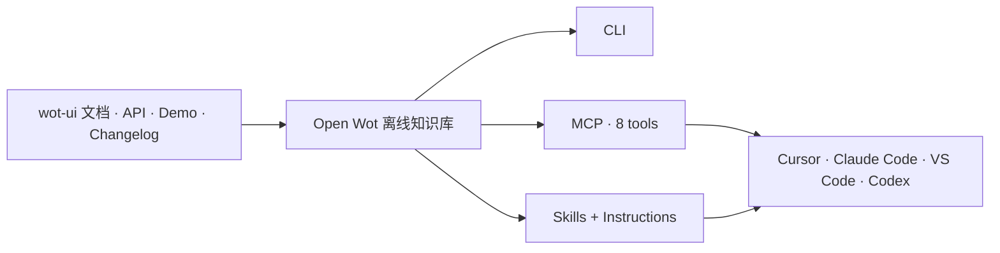

<p align="center">
  <a href="https://wot-ui.cn">
    
  </a>
</p>

<h1 align="center">@wot-ui/cli</h1>

<p align="center"><strong>让 AI 真正懂 wot-ui。</strong></p>

<p align="center">
  把组件 API、文档、示例和版本知识，接入你的终端与 AI 编程工具。
</p>

<p align="center">
  <a href="https://www.npmjs.com/package/@wot-ui/cli"></a>
  <a href="https://www.npmjs.com/package/@wot-ui/cli"></a>
  <a href="https://github.com/wot-ui/open-wot/actions/workflows/ci.yml"></a>
  <a href="./LICENSE.md"></a>
</p>

<p align="center">
  <a href="https://cli.wot-ui.cn">官方网站</a>
  · <a href="#-30-秒接入">快速开始</a>
  · <a href="#给-ai-使用推荐">Agent 接入</a>
  · <a href="#在终端使用">CLI</a>
  · <a href="#只配置-mcp">MCP</a>
  · <a href="./CONTRIBUTING.md">参与贡献</a>
</p>

---

组件文档不应该只能被人阅读。Open Wot 将 wot-ui v2 的组件知识打包成离线数据，并通过 CLI、MCP 和 Skills 提供给开发者与 AI Agent。

- **不猜 API**：查询真实的 props、events、slots、CSS 变量和 demo 源码。
- **版本对得上**：自动识别项目依赖，也可以精确查询指定的 wot-ui 版本。
- **知识离线可用**：组件数据随 npm 包发布，无需文档 API 或密钥。
- **配置安全可控**：支持 dry-run、幂等写入、原子更新和失败保护。

## 🚀 30 秒接入

需要 Node.js `>= 20`。

```bash
npm install -g @wot-ui/cli@latest
wot agent init --client cursor
wot agent doctor --client cursor
```

完成后，当前项目会获得：

```text
MCP Server       AI 可以按需调用 8 个 wot-ui tools
wot-ui-v2 Skill  AI 知道何时、如何选择和使用组件
Instructions     AI 在生成代码前主动查询真实组件知识
```

使用其他客户端时，只需替换 client id：

| Claude Code | Cursor | VS Code | Codex |
| --- | --- | --- | --- |
| `claude` | `cursor` | `vscode` | `codex` |

同时使用多个 AI 客户端时，可以一次完成全部项目级配置：

```bash
wot agent init --client all
wot agent doctor --client all --timeout 30000
```

`--client all` 在 project scope 下会处理 Claude Code、Cursor、VS Code 和 Codex；在 user scope 下只处理支持用户级配置的客户端。

配置完成后重启客户端；如果出现“信任项目”或“批准 MCP Server”的提示，请按客户端指引确认。

## ✨ 它解决什么问题

没有上下文的 AI 容易混用 Vue 组件库 API、使用不存在的属性，或者生成与项目版本不匹配的代码。Open Wot 在 AI 写代码前补上准确的 wot-ui 上下文：



它也可以单独作为一个快速的组件知识 CLI：

```console
$ wot info Button

Button 按钮 (wd-button)
按钮用于触发一个操作，如提交表单或打开链接。

Props:
- type: string = primary
- variant: string = base
- size: string = medium
- disabled: boolean = false
- loading: boolean = false

Events:
- click (`event`): 点击事件

Slots:
- default: 按钮内容
```

## 给 AI 使用（推荐）

`agent init` 是推荐入口，它会同时配置 MCP、安装 Skill，并写入由 open-wot 管理的项目 Instructions。

```bash
wot agent init --client cursor
wot agent status --client cursor
wot agent doctor --client cursor
```

整个生命周期都可以通过 CLI 管理：

```bash
wot agent list
wot agent init --client cursor --dry-run
wot agent init --client cursor
wot agent status --client cursor
wot agent doctor --client cursor
wot agent remove --client cursor
```

多客户端项目：

```bash
wot agent init --client all
wot agent status --client all
wot agent doctor --client all --timeout 30000
wot agent remove --client all --dry-run
```

- `--dry-run` 只展示变更计划，不写文件。
- 交互式写操作会请求确认；Agent 或 CI 中显式传入 `--yes`。
- 重复执行 `init` 不会重复插入配置。
- `remove` 只移除 open-wot 管理的内容，不覆盖其他 Server 或用户配置。
- 默认安装面向组件使用者的 `wot-ui-v2` Skill；仓库维护 Skill `wot-ui-cli` 不会默认安装。

只接入部分能力：

```bash
wot agent init --client codex --with mcp
wot agent init --client claude --with skill,instructions
```

<details>
<summary><strong>不想自己操作？复制这段话给 AI</strong></summary>

```text
请在当前项目中接入 wot-ui 的 AI 开发能力：

1. 确认 Node.js >= 20。
2. 安装或更新 `@wot-ui/cli@latest`；优先全局安装，不要使用 sudo。权限受限时改用 `npx -y @wot-ui/cli@latest` 执行后续命令。
3. 识别当前客户端：Claude Code=claude、Cursor=cursor、VS Code=vscode、Codex=codex。无法确定时先询问我。
4. 执行 `wot agent init --client <client-id> --scope project --with mcp,skill,instructions --yes`。
5. 执行 `wot agent doctor --client <client-id> --scope project --with mcp,skill,instructions`。
6. 告诉我修改了哪些文件、doctor 结果，以及是否需要重启客户端或批准 MCP。

请保留已有 MCP Server 和用户内容；如果安全检查失败，说明原因，不要绕过。
```

</details>

## 在终端使用

推荐全局安装：

```bash
npm install -g @wot-ui/cli@latest
wot -V
```

一次性查询也可以直接使用 package runner：

```bash
npx -y @wot-ui/cli@latest info Button
pnpm dlx @wot-ui/cli@latest info Button
```

### 组件知识

| 命令 | 用途 |
| --- | --- |
| `wot list [keyword]` | 按名称、中文名、标签、分类或描述查找组件 |
| `wot info <component>` | 查询 props、events、slots 和 CSS 变量 |
| `wot doc <component>` | 获取完整 Markdown 文档 |
| `wot demo <component> [name]` | 查看 demo 列表或指定 demo 源码 |
| `wot token [component]` | 查询组件 CSS 变量 |
| `wot changelog [versionOrComponent] [component]` | 按版本或组件查询更新记录 |

```bash
wot list button
wot info Button
wot demo Button demo-1
wot token Button
```

### 项目分析

| 命令 | 用途 |
| --- | --- |
| `wot doctor [dir]` | 检查依赖、运行环境和基础集成 |
| `wot usage [dir]` | 统计 `.vue` 文件中的 `wd-*` 使用情况 |
| `wot lint [dir]` | 检查未知组件、空按钮等问题 |

### 版本与结构化输出

```bash
wot info Button --version 2.0
wot info Button --version 2.0.4
wot list --version latest --format json
```

不传 `--version` 时，CLI 会依次检查项目安装版本、依赖声明和最新离线数据。查询命令支持 `--format text|json|markdown`；结构化结果写入 stdout，诊断信息保持在 stderr。

## 只配置 MCP

如果只需要 MCP，不需要 Skill 和 Instructions：

```bash
wot mcp list
wot mcp init --client cursor
wot mcp status --client cursor
wot mcp doctor --client cursor
wot mcp remove --client cursor
```

支持的项目配置：

| Client | 文件 | 配置根字段 |
| --- | --- | --- |
| Claude Code | `.mcp.json` | `mcpServers` |
| Cursor | `.cursor/mcp.json` | `mcpServers` |
| VS Code | `.vscode/mcp.json` | `servers` |
| Codex | `.codex/config.toml` | `mcp_servers.wot-ui` |

```bash
wot mcp print --client cursor             # 只预览配置
wot mcp init --client cursor --dry-run    # 预览文件变更
wot mcp init --client all                 # 配置所有客户端
wot mcp init --client codex --pin         # 固定当前 CLI 版本
```

Claude Code、Cursor 和 Codex 支持 `--scope user`；VS Code 当前使用 project scope。`doctor` 会验证配置和真实 MCP handshake，并在客户端支持时继续检查注册状态。

直接启动 stdio Server：

```bash
wot mcp                                  # 默认启动
wot mcp serve                            # 语义明确的等价写法
```

<details>
<summary><strong>手动配置 MCP</strong></summary>

自动配置默认使用 `npx` 启动 Server，避免桌面应用读取不到终端的全局 `PATH`：

```json
{
  "mcpServers": {
    "wot-ui": {
      "command": "npx",
      "args": ["-y", "@wot-ui/cli", "mcp"]
    }
  }
}
```

已全局安装且客户端能够找到 `wot` 时，也可以使用：

```json
{
  "mcpServers": {
    "wot-ui": {
      "command": "wot",
      "args": ["mcp"]
    }
  }
}
```

</details>

<details>
<summary><strong>8 个 MCP tools</strong></summary>

| Tool | 能力 |
| --- | --- |
| `wot_status` | Server、CLI 版本与更新状态 |
| `wot_list` | 组件发现与摘要 |
| `wot_info` | props、events、slots、CSS 变量 |
| `wot_doc` | 完整组件文档 |
| `wot_demo` | demo 摘要或指定示例源码 |
| `wot_token` | 组件 CSS 变量 |
| `wot_changelog` | 版本与组件更新记录 |
| `wot_lint` | 项目中的 wot-ui 使用问题 |

</details>

## 完整命令速查

<details>
<summary><strong>展开全部命令和参数</strong></summary>

### 组件知识与项目分析

| 命令 | 说明 |
| --- | --- |
| `wot list [keyword]` | 查找组件 |
| `wot info <component>` | 查询组件 API |
| `wot doc <component>` | 获取完整文档 |
| `wot demo <component> [name]` | 查询 demo |
| `wot token [component]` | 查询 CSS 变量 |
| `wot changelog [versionOrComponent] [component]` | 查询更新记录 |
| `wot doctor [dir]` | 诊断项目环境 |
| `wot usage [dir]` | 分析组件使用情况 |
| `wot lint [dir]` | 检查组件使用问题 |

以上查询命令都支持 `--version <version>` 和 `--format text|json|markdown`。

### Agent

| 命令 | 说明 |
| --- | --- |
| `wot agent list` | 列出支持和检测到的客户端 |
| `wot agent init` | 初始化 MCP、Skill 和 Instructions |
| `wot agent status` | 检查三类能力的配置状态 |
| `wot agent doctor` | 检查文件并执行真实 MCP handshake |
| `wot agent remove` | 删除 open-wot 管理的接入内容 |

`init`、`status`、`doctor` 和 `remove` 支持：

- `--client auto|all|claude|cursor|vscode|codex`
- `--scope project|user`
- `--with mcp,skill,instructions`
- `--cwd <directory>`
- `--format text|json`
- `--pin [version]`

其中 `init`、`remove` 额外支持 `--dry-run` 和 `--yes`，`doctor` 支持 `--timeout <milliseconds>`。

### MCP

| 命令 | 说明 |
| --- | --- |
| `wot mcp` | 启动 stdio Server |
| `wot mcp serve` | 显式启动 stdio Server |
| `wot mcp list` | 列出客户端和检测结果 |
| `wot mcp init` | 写入 MCP 配置 |
| `wot mcp status` | 检查 MCP 配置 |
| `wot mcp doctor` | 验证配置、handshake 和客户端状态 |
| `wot mcp remove` | 删除托管的 MCP 配置 |
| `wot mcp print` | 输出单个客户端的配置片段 |

`init`、`status`、`doctor`、`remove` 和 `print` 支持 `--client`、`--scope`、`--cwd`、`--format` 和 `--pin`；`init`、`remove` 额外支持 `--dry-run`、`--yes`，`doctor` 支持 `--timeout`。`list` 支持 `--cwd` 和 `--format`；`print` 必须指定一个具体客户端，不能使用 `auto` 或 `all`。

随时可以查看 CLI 自带帮助：

```bash
wot --help
wot agent init --help
wot mcp doctor --help
```

</details>

## 安全设计

open-wot 会修改客户端配置，因此写入流程默认保守：

- 先计算 ChangePlan，再确认或执行。
- 支持 `--dry-run` 和 JSON 预览。
- 保留已有 Server、JSONC 注释和非托管 TOML。
- 使用原子写入，并在失败时回滚。
- 遇到非法配置或无法安全接管的结构时直接停止。
- Agent Instructions 使用明确的托管标记，避免误删用户内容。

## 开发 open-wot

环境要求：Node.js `>= 20`、pnpm `10.25.x`。

### 安装与开发

```bash
pnpm install
pnpm dev          # 监听源码并持续构建 dist/
```

也可以直接运行 TypeScript 源码：

```bash
pnpm exec tsx src/index.ts list
pnpm exec tsx src/index.ts info Button --version 2.0
pnpm exec tsx src/index.ts mcp
```

调试最终构建产物：

```bash
pnpm build
node dist/index.mjs list
node dist/index.mjs mcp doctor --client cursor
```

### 提交前验证

```bash
pnpm lint
pnpm typecheck
pnpm test
pnpm build
```

测试开发：

```bash
pnpm test:watch
pnpm test:coverage
```

CI 会在 Node.js 20/22 以及 Ubuntu、Windows、macOS 上执行对应检查。

### 更新离线数据

```bash
pnpm sync:clone       # 同步全部 stable 快照
pnpm extract:clone    # 只提取最新版本
```

已有本地 wot-ui 仓库时：

```bash
pnpm sync --wot-dir ../wot-ui
pnpm extract --wot-dir ../wot-ui --output data/v2.0.4.json
```

修改 CLI、MCP、数据提取、Skill 或发布文件时，需要执行的定向验证不同。完整仓库结构、验证矩阵、打包与提交流程见 [CONTRIBUTING.md](./CONTRIBUTING.md)。

## 当前边界

- 当前仅支持 wot-ui v2。
- `usage` 与 `lint` 聚焦 `.vue` 文件中的 `<wd-*>` 标签及相关 import。
- 提取脚本优先从 SCSS 解析 CSS 变量，必要时回退到 Markdown 表格。

## License

[MIT](./LICENSE.md) License © wot-ui
